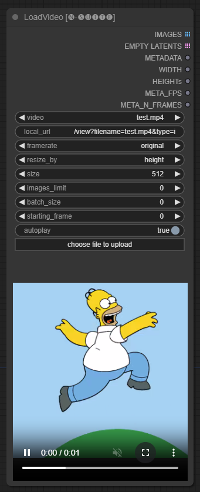
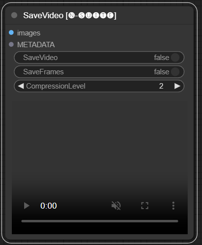
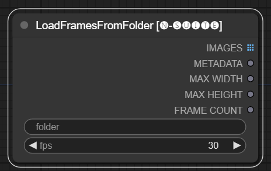
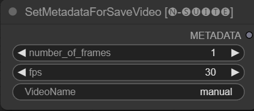
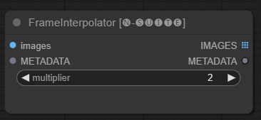
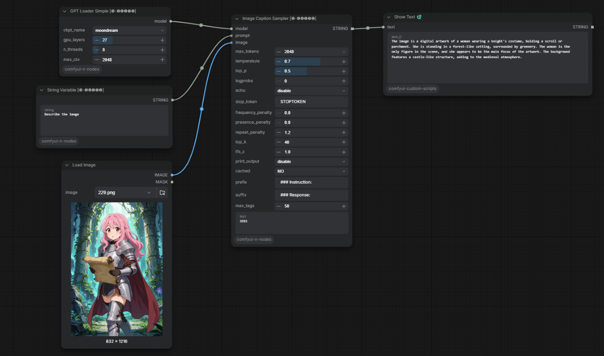
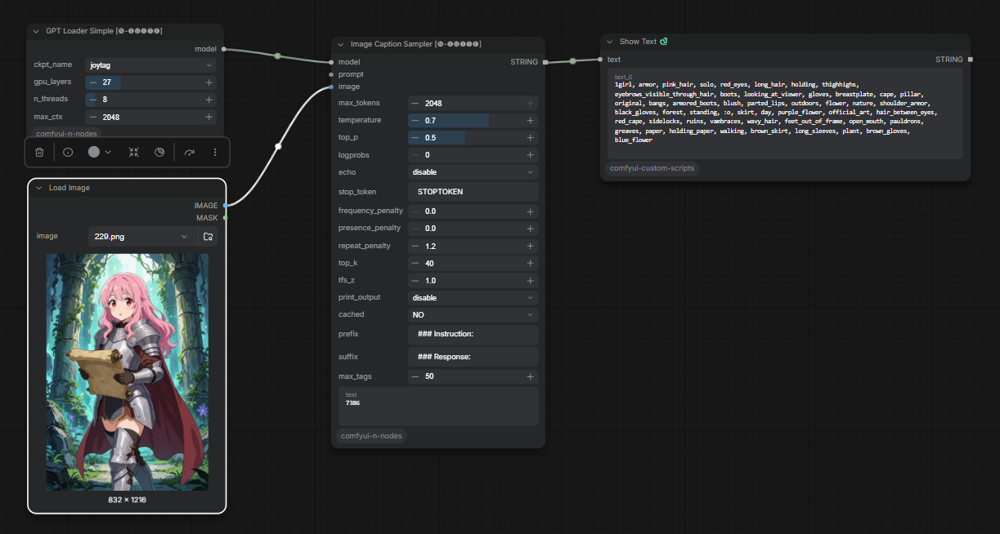
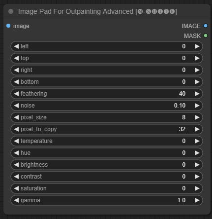
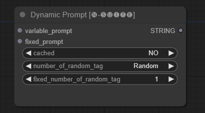
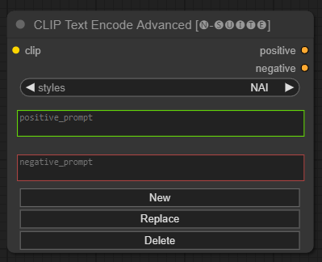

# ComfyUI-N-Suite
A suite of custom nodes for ComfyUI that includes integer, string and float variable nodes, image-captioning nodes and video nodes.

The nodes support ComfyUI's Python environment on Windows and Linux. The current dependencies include MoviePy 2, timm 1.0.22 or newer, accelerate 1.x, and transformers 4.36.2 through 4.x.

# Installation

1. Install **ComfyUI-N-Nodes** through ComfyUI Manager (recommended). For a manual install, clone `https://github.com/Nuked88/ComfyUI-N-Nodes.git` into ComfyUI's `custom_nodes` directory and run `python -m pip install -r requirements.txt` using the same Python environment that runs ComfyUI.
2. Ensure `ComfyUI/models/GPTcheckpoints` is writable by the ComfyUI process so Moondream and JoyTag can download their models.
3. Restart ComfyUI. The extension clones pinned RIFE code and downloads its pinned model at startup on a fresh install; an internet connection is needed for that first startup.

ComfyUI automatically loads all custom scripts and nodes at startup.

> [!IMPORTANT]
> **Breaking change in 1.2.0:** `llama-cpp-python` integration has been removed because its platform-specific installation was the main source of installation and startup failures. GGUF text-generation models and LLaVA nodes are therefore no longer available in N-Suite. Existing workflows using `Llava Clip Loader` must remove that node; `GPT Loader Simple` and `GPT Sampler` now support only Moondream and JoyTag. N-Suite no longer detects, downloads, or installs `llama-cpp-python`.

> [!WARNING]
> **The `Llava Clip Loader` node and the GGUF text-generation path of `GPT Loader Simple` / `GPT Sampler` have been removed.** To keep using those legacy nodes, install the last revision that contains them with `git checkout ae7cc84`. That revision is unsupported and retains the `llama-cpp-python` installation problems; use it in a separate ComfyUI installation or Python environment.

> [!NOTE]  
> Since 14/02/2024, the node has undergone a massive rewrite, which also led to the change of all node names in order to avoid any conflicts with other extensions in the future (or at least I hope so). Consequently, the old workflows are no longer compatible and will require manual replacement of each node.
> To avoid this, I have created a tool that allows for automatic replacement.
> On Windows, simply drag any *.json workflow onto the migrate.bat file located in (custom_nodes/ComfyUI-N-Nodes), and another workflow with the suffix _migrated will be created in the same folder as the current workflow.
> On Linux, you can use the script in the following way: python libs/migrate.py path/to/original/workflow/.
> For security reasons, the original workflow will not be deleted."
> For install the last version of this repository before this changes from the Comfyui-N-Suite execute **git checkout 29b2e43baba81ee556b2930b0ca0a9c978c47083**

For uninstallation, remove the extension through ComfyUI Manager or delete its folder from `custom_nodes`, then restart ComfyUI. Model files in `models/GPTcheckpoints` are user data and can be kept for a later reinstall.

# Update
Update through ComfyUI Manager. For a manual install, run `git pull` in the cloned extension directory, install `requirements.txt` again in ComfyUI's Python environment, and restart ComfyUI.

## Test workflow

[`examples/N-Suite-all-nodes-test.json`](examples/N-Suite-all-nodes-test.json) connects all 14 N-Suite node types in one workflow. Follow the [test instructions](examples/README.md) to add an image, a short MP4, and numbered PNG frames before running it.

# Features

## 📽️ Video Nodes 📽️

### LoadVideo

The LoadVideoAdvanced node allows loading a video file and extracting frames from it.
The name has been changed from `LoadVideo` to `LoadVideoAdvanced` in order to avoid conflicts with the `LoadVideo` animatediff node.

#### Input Fields
- `video`: Select the video file to load.
- `framerate`: Choose whether to keep the original framerate or reduce to half or quarter speed.
- `resize_by`: Select how to resize frames - 'none', 'height', or 'width'.
- `size`: Target size if resizing by height or width.
- `images_limit`: Limit number of frames to extract.
- `batch_size`: Batch size for encoding frames.
- `starting_frame`: Select which frame to start from.
- `autoplay`: Select whether to autoplay the video.
- `use_ram`: Use RAM instead of disk for decompressing video frames.  

#### Output

- `IMAGES`: Extracted frame images as PyTorch tensors.
- `LATENT`: Empty latent vectors.
- `METADATA`: Video metadata - FPS and number of frames.
- `WIDTH:` Frame width.
- `HEIGHT`: Frame height.
- `META_FPS`: Frame rate.
- `META_N_FRAMES`: Number of frames.

The node extracts frames from the input video at the specified framerate. It resizes frames if chosen and returns them as batches of PyTorch image tensors along with latent vectors, metadata, and frame dimensions.

### SaveVideo
The SaveVideo node takes in extracted frames and saves them back as a video file.

#### Input Fields
- `images`: Frame images as tensors.
- `METADATA`: Metadata from LoadVideo node.
- `SaveVideo`: Toggle saving output video file.
- `SaveFrames`: Toggle saving frames to a folder.
- `CompressionLevel`: PNG compression level for saving frames.
#### Output
Saves output video file and/or extracted frames.

The node takes extracted frames and metadata and can save them as a new video file and/or individual frame images. Video compression and frame PNG compression can be configured.
NOTE: If you are using **LoadVideo** as source of the frames, the audio of the original file will be maintained but only in case **images_limit** and **starting_frame** are equal to Zero.

### LoadFramesFromFolder

The LoadFramesFromFolder node allows loading image frames from a folder and returning them as a batch.

#### Input Fields
- `folder`: Path to the folder containing the frame images.Must be png format, named with a number (eg. 1.png or even 0001.png).The images will be loaded sequentially.
- `fps`: Frames per second to assign to the loaded frames.

#### Output
- `IMAGES`: Batch of loaded frame images as PyTorch tensors.
- `METADATA`: Metadata containing the set FPS value.
- `MAX_WIDTH`: Maximum frame width.
- `MAX_HEIGHT`: Maximum frame height.
- `FRAME COUNT`: Number of frames in the folder.
- `PATH`: Path to the folder containing the frame images.
- `IMAGE LIST`: List of frame images in the folder (not a real list just a string divided by \n).

The node loads all image files from the specified folder, converts them to PyTorch tensors, and returns them as a batched tensor along with simple metadata containing the set FPS value.

This allows easily loading a set of frames that were extracted and saved previously, for example, to reload and process them again. By setting the FPS value, the frames can be properly interpreted as a video sequence.

### SetMetadataForSaveVideo

The SetMetadataForSaveVideo node allows setting metadata for the SaveVideo node.

### FrameInterpolator

The FrameInterpolator node allows interpolating between extracted video frames to increase the frame rate and smooth motion.

#### Input Fields

- `images`: Extracted frame images as tensors.
- `METADATA`: Metadata from video - FPS and number of frames.
- `multiplier`: Factor by which to increase frame rate. 

#### Output  

- `IMAGES`: Interpolated frames as image tensors.
- `METADATA`: Updated metadata with new frame rate.

The node takes extracted frames and metadata as input. It uses an interpolation model (RIFE) to generate additional in-between frames at a higher frame rate. 

The original frame rate in the metadata is multiplied by the `multiplier` value to get the new interpolated frame rate.

The interpolated frames are returned as a batch of image tensors, along with updated metadata containing the new frame rate.

This allows increasing the frame rate of an existing video to achieve smoother motion and slower playback. The interpolation model creates new realistic frames to fill in the gaps rather than just duplicating existing frames.

The original code has been taken from [HERE](https://github.com/hzwer/Practical-RIFE/tree/main)

## Variables
Since the primitive node has limitations in links (for example at the time i'm writing you cannot link "start_at_step" and "steps" of another ksampler toghether), I decided to create these simple node-variables to bypass this limitation
The node-variables are:
- Integer
- Float
- String

## 🤖 Image captioning: GPTLoaderSimple and GPTSampler 🤖

#### Moondream
The model will be automatically downloaded when you run the first time.Only the required code, tokenizer, and single `model.safetensors` file are downloaded from a pinned revision of `vikhyatk/moondream1` on Hugging Face. The model file is about **3.72 GB**; the repository also contains larger alternative weights that are not downloaded.
Anyway, it is available [HERE](https://huggingface.co/vikhyatk/moondream1/tree/main)
The code taken from [this repository](https://github.com/vikhyat/moondream)

#### Example with Moondream model:

#### Joytag
The model will be automatically downloaded when you run the first time.Only the required configuration, tags, and `model.safetensors` are downloaded from a pinned revision of `fancyfeast/joytag`. The model file is about **0.37 GB**; the unused ONNX file is not downloaded.
Anyway, it is available [HERE](https://huggingface.co/fancyfeast/joytag/tree/main)
The code taken from [this repository](https://github.com/fpgaminer/joytag)

#### Example with Joytag model:

Downloads happen on first model use, not merely when ComfyUI starts. An internet connection and sufficient disk space are required for that initial load. Models are stored under `ComfyUI/models/GPTcheckpoints/moondream` and `ComfyUI/models/GPTcheckpoints/joytag`.
GPT Loader Simple displays a download notice when the selected model file is missing. The ComfyUI console shows the download progress.
Moondream1 uses legacy Phi model code; N-Suite applies a small compatibility patch to its downloaded `modeling_phi.py` file and adapts the text model for image embedding generation with newer Transformers releases. The model weights are not changed.

### GPTLoaderSimple

`GPTLoaderSimple` loads either Moondream or JoyTag. The `gpu_layers` field is retained for workflow compatibility: set it to `0` for CPU, or to a value greater than zero for GPU. The old `n_threads` and `max_ctx` fields are also retained so saved workflows continue to deserialize, but they do not affect these image-captioning models.

### GPTSampler

Connect an image and, for Moondream, a question or instruction in `prompt`. JoyTag uses `max_tags` to limit the number of returned tags. The advanced text-generation controls remain visible for workflow compatibility but no longer apply to GGUF text generation.

## Image Pad For Outpainting Advanced 

The `ImagePadForOutpaintingAdvanced` node is an alternative to the `ImagePadForOutpainting` node that applies the technique seen in [this video](https://www.youtube.com/@robadams2451) under the outpainting mask.
The color correction part was taken from [this](https://github.com/sipherxyz/comfyui-art-venture) custom node from Sipherxyz

#### Input Fields

- `image`: Image input.
- `left`: pixel to extend from left,
- `top`: pixel to extend from top,
- `right`: pixel to extend from right,
- `bottom`: pixel to extend from bottom.
- `feathering`: feathering strength
- `noise`: blend strenght from noise and the copied border
- `pixel_size`: how big will be the pixel in the pixellated effect
- `pixel_to_copy`: how many pixels to copy (from each side)
- `temperature`: color correction setting that is only applied to the mask part.
- `hue`: color correction setting that is only applied to the mask part.
- `brightness`: color correction setting that is only applied to the mask part.
- `contrast`: color correction setting that is only applied to the mask part.
- `saturation`: color correction setting that is only applied to the mask part.
- `gamma`: color correction setting that is only applied to the mask part.

#### Output

The node returns the processed image and the mask.

## Dynamic Prompt

The `DynamicPrompt` node generates prompts by combining a fixed prompt with a random selection of tags from a variable prompt. This enables flexible and dynamic prompt generation for various use cases.

#### Input Fields

- `variable_prompt`: Enter the variable prompt for tag selection.
- `cached`: Choose whether to cache the generated prompt (default: NO).
- `number_of_random_tag`: Choose between "Fixed" and "Random" for the number of random tags to include.
- `fixed_number_of_random_tag`: If `number_of_random_tag` if "Fixed" Specify the number of random tags to include (default: 1).
- `fixed_prompt` (Optional): Enter the fixed prompt for generating the final prompt.

#### Output

The node returns the generated prompt, which is a combination of the fixed prompt and selected random tags.

#### Example Usage

- Just fill the `variable_prompt` field with tag comma separated, the `fixed_prompt` is optional

## CLIP Text Encode Advanced (Experimental)

The `CLIP Text Encode Advanced` node is an alternative to the standard `CLIP Text Encode` node. It offers support for Add/Replace/Delete styles, allowing for the inclusion of both positive and negative prompts within a single node.

The base style file is called `n-styles.csv` and is located in the `ComfyUI\styles` folder.
The styles file follows the same format as the current `styles.csv` file utilized in A1111 (at the time of writing).

NOTE: this note is experimental and still have alot of bugs

#### Input Fields

- `clip`: clip input 
- `style`: it will automatically fill the positive and negative prompts based on the choosen style

#### Output
- `positive`: positive conditions
- `negative`: negative conditions

## Troubleshooting

- ~~**SaveVideo - Preview not working**: is related to a conflict with animateDiff, i've already opened a [PR](https://github.com/ArtVentureX/comfyui-animatediff/pull/64) to solve this issue. Meanwhile you can download my patched version from [here](https://github.com/Nuked88/comfyui-animatediff)~~ pull has been merged so this problem should be fixed now!

## Contributing

Feel free to contribute to this project by reporting issues or suggesting improvements. Open an issue or submit a pull request on the GitHub repository.

## License

This project is licensed under the MIT License. See the [LICENSE](LICENSE) file for details.
